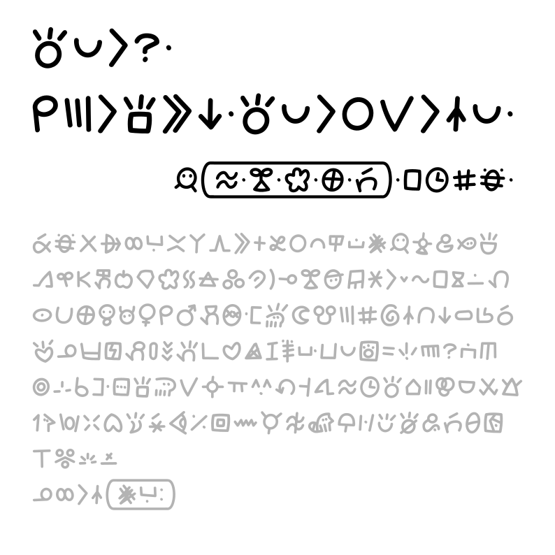

# toki!

mi jan Janpa Onjon. mi o pana e nasin pi sitelen pona! ona li tan sitelen pona luka mi li suwi lili li musi mute! o pona kepeken nasin sitelen mi. :D

# o sona

the build script (build.py) is based off [Robert Winslow's code](https://github.com/RobertWinslow/Simple-SVG-to-Font-with-Fontforge/blob/main/build_simple_black_font_with_fontforge.py). the script is released under a [CC BY-SA 4.0](https://creativecommons.org/licenses/by-sa/4.0/legalcode.en) license.

the nasin-janpa font itself(nasin-janpa.ttf) is released under an [OFL-1.1](https://spdx.org/licenses/OFL-1.1.html) license.